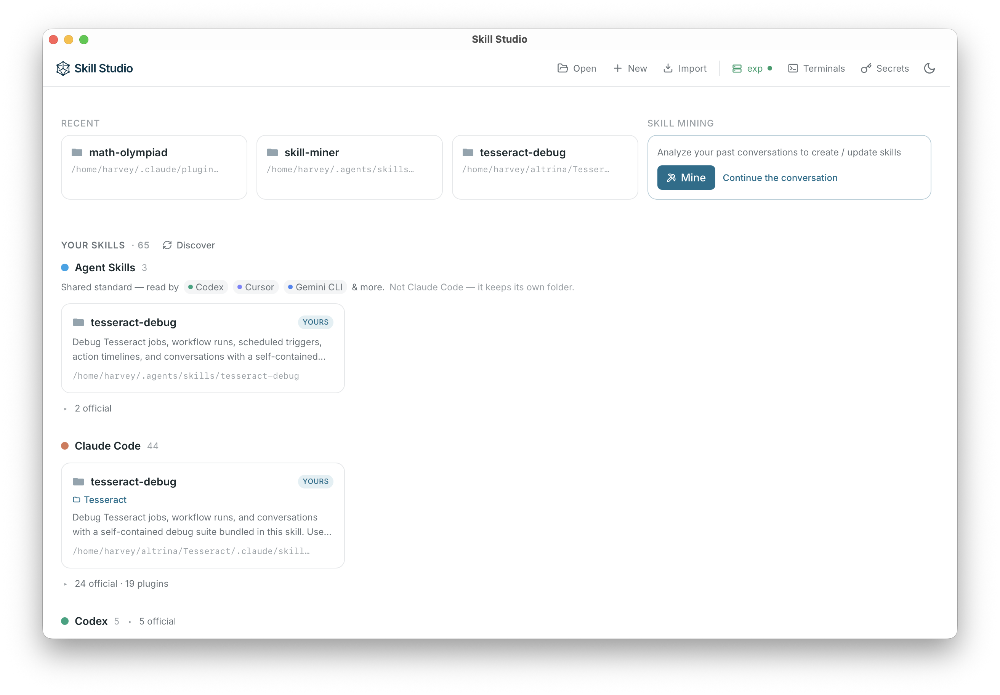

# Skill Studio

A desktop app for **viewing, editing, versioning, and running
[Agent Skills](https://agentskills.io/home)** — the portable folders of human
expert knowledge that agents load on demand.



Managing skills is like managing a team's culture and policies: written once,
leveraged by every agent. Studio gives that knowledge a human interface so you
can see, diff, version, and share your skills instead of letting them drift
across a dozen agent config dirs.

Built with [Tauri](https://tauri.app/) (Rust backend + React/TS frontend). The
backend is separable from the UI, so it runs natively *or* headless on a remote
box you drive from a browser (the VS Code-remote model — see [`design.md`](./design.md)).

## Features

- **Discover** every skill on your machine — across Claude Code, Codex, Cursor,
  Gemini CLI, OpenClaw, the shared `~/.agents/skills` standard, and project repos
  — classified personal / official / plugin.
- **Skill Mining** *(new — ready to use)* — a local agent that reads your past
  agent conversations to surface the skills that would have helped, then drafts
  new ones or improves the skills you already have. It runs as an interactive
  session right in the app — watch it work and keep what's useful. Kick it off
  from the **Skill Mining** card on the home screen.
- **A Notion-like UI/UX for your agent skills** — `SKILL.md` rendered as a clean
  document with frontmatter badges, a GFM body, and a full file-tree browser;
  double-click to toggle render/edit, with a frontmatter form, CodeMirror body
  editor, live preview, and autosave scoped to the folder.
- **Automatic versioning** — a VS Code-style Source Control panel per skill:
  working-tree changes, inline diffs, discard, and numbered commit history,
  parent-repo aware. Commit messages are drafted locally by the on-device 2B
  Qwen model — nothing leaves the machine.
- **Secrets manager** — one machine-local store. Terminals launched from the
  app inject the secrets into the agent's environment automatically; skills
  declare what they need (`metadata.required-env`, auto-detected on save) so
  exports can offer to bundle them and imports can show what's missing. The
  bundled `load-secrets` activation skill covers agents started elsewhere.
- **Terminals & remote hosts** — run Claude Code, Codex, or a shell in
  tmux-backed sessions that survive UI disconnect, so you can close your laptop
  and pick the run back up later. Point Studio at an SSH host or a local WSL
  distro and it provisions a matching `skill-server` there, so you edit and run
  skills on that machine as if it were local (the VS Code-remote model).

## Run it

```bash
npm install
npm run dev          # native desktop
```

| Mode | Command | Open |
|------|---------|------|
| Native desktop | `npm run dev` | the app window |
| Browser, local backend | `cargo run -p skill-server` + `npm run dev:vite` | `localhost:1420` |
| Production | `npm run build`, then run `skill-server` | skill-server's port |

Open a skill via the discovered list, the top-bar path input, **Browse…**, or a
`?path=/abs/path/to/skill` deep link. The on-device LLM bundles a prebuilt
`llama-server` (`scripts/fetch-engine.sh`); the model downloads on first use.
`examples/` holds real document skills (`docx`, `pdf`, `pptx`, `xlsx`).

## Roadmap

The thesis: the future is humans and AI agents **collaborating**, not humans
replaced — and skills are the medium for human expert knowledge, so they need a
first-class human UX. Next:

1. **Version-controlled team collaboration & team secret managers** — share
   skills and the secrets they need across a team, account-backed.
2. **Multi-modal skills / SOP documents** in a readable format.

Skill Mining shipped — see Features above.

## Notes

- Reads/writes are constrained to the loaded skill folder (no `..` escapes); run
  it on folders you trust. Markdown renders without raw-HTML passthrough.
- The desktop CSP is `default-src 'self'`; any outbound network originates in
  Rust, never the webview — so a skill's diff is never sent anywhere.
